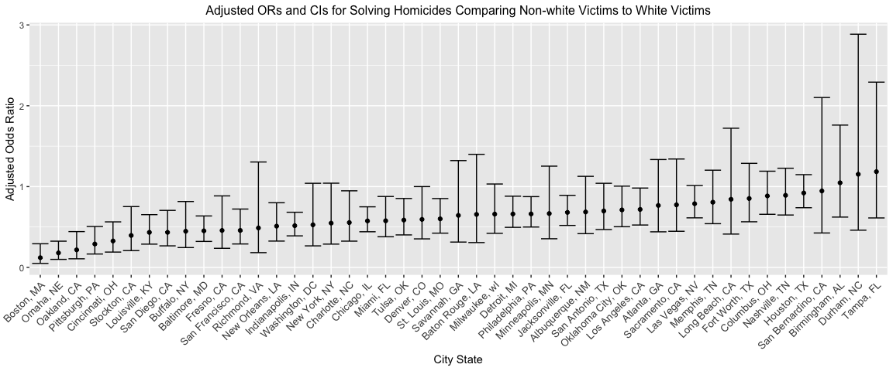
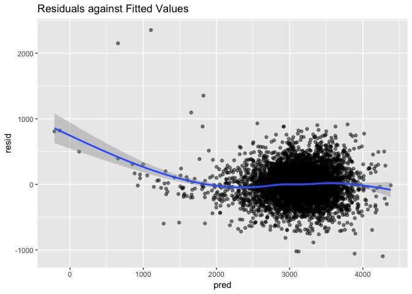

p8105\_hw6\_zf2212
================
Catherine
11/24/2018

### Context

This assignment reinforces ideas in Linear Models.

### Problem 1

#### 1.1

Create a city\_state variable and a binary variable indicating whether the homicide is solved. Omit cities Dallas, TX; Phoenix, AZ; and Kansas City, MO – these don’t report victim race. Also omit Tulsa, AL – this is a data entry mistake. Modifiy victim\_race to have categories white and non-white, with white as the reference category. Be sure that victim\_age is numeric.

``` r
homicides_raw = read.csv("./data_homicides/homicide_data.csv") %>% 
  janitor::clean_names()
```

``` r
homicides_data = homicides_raw %>%
  # creat a new variable, binary variable
  mutate(city_state = str_c(city, state, sep = ", "),
         resolved = ifelse(disposition == "Closed by arrest", 1, 0)) %>% 
  # omit some cities
  filter(!city_state %in% c("Dallas, TX", "Phoenix, AZ", "Kansas City, MO", "Tulsa, AL")) %>% 
  # modify race and age
  mutate(victim_race, victim_race = ifelse(victim_race == "White", "white", "non-white"),
         victim_race = fct_relevel(victim_race, "white"),
         victim_age = as.numeric(victim_age)) 
```

`city_state` includes the city and state information of each cases.

`resolved` indicates whether the homicide is solved, `0` is unsolved and `1` is solved.

`victim_race` is cataogrized by `white` and `non-white`.

`victim_age` is an double.

#### 1.2

For the city of Baltimore, MD, use the glm function to fit a logistic regression with resolved vs unresolved as the outcome and victim age, sex and race (as just defined) as predictors. Save the output of glm as an R object; apply the broom::tidy to this object; and obtain the estimate and confidence interval of the adjusted odds ratio for solving homicides comparing non-white victims to white victims keeping all other variables fixed.

``` r
# filter baltimore data
btm_data = homicides_data %>% 
  filter(city_state == "Baltimore, MD")
# fit the regression model
btm_logistic = 
  btm_data %>% 
  glm(resolved ~ victim_age + victim_race + victim_sex, data = ., family = binomial()) 
# apply broom::tidy 
btm_logistic %>% 
  broom::tidy() %>% 
  mutate(OR = exp(estimate),
         conf_low = exp(estimate - std.error*1.96),
         conf_up = exp(estimate + std.error*1.96)) %>% # transform back
  select(term, log_OR = estimate, OR, p.value, conf_low, conf_up) %>% 
  filter(term == "victim_racenon-white") %>% 
  select(-term) %>% 
  knitr::kable(digits = 3)
```

|  log\_OR|     OR|  p.value|  conf\_low|  conf\_up|
|--------:|------:|--------:|----------:|---------:|
|   -0.793|  0.453|        0|      0.322|     0.637|

Now run glm for each of the cities in your dataset, and extract the adjusted odds ratio (and CI) for solving homicides comparing non-white victims to white victims. Do this within a “tidy” pipeline, making use of purrr::map, list columns, and unnest as necessary to create a dataframe with estimated ORs and CIs for each city.

``` r
race_compare = function(glm){
  
  table = glm %>% 
    broom::tidy() %>% 
    mutate(OR = exp(estimate),
         conf_low = exp(estimate - std.error*1.96),
         conf_up = exp(estimate + std.error*1.96)) %>% 
    select(term, log_OR = estimate, OR, p.value, conf_low, conf_up) %>% 
    filter(term == "victim_racenon-white") %>% 
    select(-term) 
  
  return(table)
  }
```

``` r
# apply to all cities
all_logistic = homicides_data %>% 
  select(city_state, resolved, victim_race, victim_age, victim_sex) %>% 
  group_by(city_state) %>% 
  nest() %>% 
  mutate(glm = map(data, ~ glm(resolved ~ victim_age + victim_sex + victim_race, data = .x, family = binomial()))) %>% 
  mutate(output = map(glm, race_compare)) %>%
  select(city_state, output) %>% 
  unnest() %>% 
  select(-c(log_OR, p.value))

knitr::kable(all_logistic, digits = 3)
```

| city\_state        |     OR|  conf\_low|  conf\_up|
|:-------------------|------:|----------:|---------:|
| Albuquerque, NM    |  0.686|      0.418|     1.127|
| Atlanta, GA        |  0.767|      0.440|     1.335|
| Baltimore, MD      |  0.453|      0.322|     0.637|
| Baton Rouge, LA    |  0.656|      0.307|     1.399|
| Birmingham, AL     |  1.047|      0.623|     1.761|
| Boston, MA         |  0.121|      0.050|     0.293|
| Buffalo, NY        |  0.447|      0.245|     0.815|
| Charlotte, NC      |  0.555|      0.325|     0.948|
| Chicago, IL        |  0.575|      0.441|     0.750|
| Cincinnati, OH     |  0.327|      0.190|     0.564|
| Columbus, OH       |  0.884|      0.657|     1.191|
| Denver, CO         |  0.594|      0.353|     1.000|
| Detroit, MI        |  0.661|      0.496|     0.881|
| Durham, NC         |  1.153|      0.461|     2.885|
| Fort Worth, TX     |  0.853|      0.565|     1.288|
| Fresno, CA         |  0.457|      0.236|     0.885|
| Houston, TX        |  0.921|      0.739|     1.148|
| Indianapolis, IN   |  0.516|      0.390|     0.683|
| Jacksonville, FL   |  0.681|      0.519|     0.892|
| Las Vegas, NV      |  0.788|      0.613|     1.013|
| Long Beach, CA     |  0.843|      0.413|     1.722|
| Los Angeles, CA    |  0.718|      0.525|     0.982|
| Louisville, KY     |  0.434|      0.288|     0.653|
| Memphis, TN        |  0.807|      0.541|     1.203|
| Miami, FL          |  0.577|      0.379|     0.878|
| Milwaukee, wI      |  0.660|      0.422|     1.032|
| Minneapolis, MN    |  0.667|      0.355|     1.253|
| Nashville, TN      |  0.892|      0.648|     1.227|
| New Orleans, LA    |  0.511|      0.326|     0.800|
| New York, NY       |  0.548|      0.288|     1.042|
| Oakland, CA        |  0.217|      0.107|     0.443|
| Oklahoma City, OK  |  0.711|      0.503|     1.005|
| Omaha, NE          |  0.180|      0.099|     0.325|
| Philadelphia, PA   |  0.662|      0.500|     0.876|
| Pittsburgh, PA     |  0.290|      0.166|     0.506|
| Richmond, VA       |  0.488|      0.183|     1.304|
| San Antonio, TX    |  0.698|      0.469|     1.041|
| Sacramento, CA     |  0.774|      0.447|     1.341|
| Savannah, GA       |  0.644|      0.314|     1.322|
| San Bernardino, CA |  0.946|      0.426|     2.102|
| San Diego, CA      |  0.434|      0.267|     0.706|
| San Francisco, CA  |  0.458|      0.290|     0.722|
| St. Louis, MO      |  0.601|      0.424|     0.852|
| Stockton, CA       |  0.395|      0.208|     0.752|
| Tampa, FL          |  1.185|      0.612|     2.292|
| Tulsa, OK          |  0.586|      0.402|     0.853|
| Washington, DC     |  0.527|      0.267|     1.041|

Create a plot that shows the estimated ORs and CIs for each city. Organize cities according to estimated OR, and comment on the plot.

``` r
all_logistic %>% 
  mutate(city_state, city_state = fct_reorder(city_state, OR)) %>% 
  ggplot(aes(x = city_state, y = OR)) +
  geom_point() +
  geom_errorbar(aes(ymin = conf_low, ymax = conf_up)) +
  theme(axis.text.x = element_text(angle = 45, hjust = 1, size = 10), plot.title = element_text(hjust = 0.5, size = 12)) +
  labs(title = "Adjusted ORs and CIs for Solving Homicides Comparing Non-white Victims to White Victims",
       y = "Adjusted Odds Ratio",
       x = "City State")
```



**Comment**

Most of the cities have `Adjusted OR` below 1 except `Birmingham, AL`, `Durham, NC`, `Tampa, FL`. `Adjusted OR` less than 1 means the homicides of non-white victims are less likely to be solved than those of white victims. `Boston, MA` has the lowest `Adjusted OR` and `Tampa, FL` has the highest `Adjusted OR`.

### Problem 2

#### 2.1

Propose a regression model for birthweight. This model may be based on a hypothesized structure for the factors that underly birthweight, on a data-driven model-building process, or a combination of the two. Describe your modeling process and show a plot of model residuals against fitted values – use add\_predictions and add\_residuals in making this plot.

``` r
bw_raw = read_csv("./data/birthweight.csv") %>% 
  janitor::clean_names()
```

    ## Parsed with column specification:
    ## cols(
    ##   .default = col_integer(),
    ##   gaweeks = col_double(),
    ##   ppbmi = col_double(),
    ##   smoken = col_double()
    ## )

    ## See spec(...) for full column specifications.

``` r
# look at the data
skimr::skim_to_wide(bw_raw) %>%  
  knitr::kable()
```

| type    | variable | missing | complete | n    | mean   | sd     | p0    | p25   | p50    | p75   | p100 | hist     |
|:--------|:---------|:--------|:---------|:-----|:-------|:-------|:------|:------|:-------|:------|:-----|:---------|
| integer | babysex  | 0       | 4342     | 4342 | 1.49   | 0.5    | 1     | 1     | 1      | 2     | 2    | ▇▁▁▁▁▁▁▇ |
| integer | bhead    | 0       | 4342     | 4342 | 33.65  | 1.62   | 21    | 33    | 34     | 35    | 41   | ▁▁▁▁▅▇▁▁ |
| integer | blength  | 0       | 4342     | 4342 | 49.75  | 2.72   | 20    | 48    | 50     | 51    | 63   | ▁▁▁▁▁▇▁▁ |
| integer | bwt      | 0       | 4342     | 4342 | 3114.4 | 512.15 | 595   | 2807  | 3132.5 | 3459  | 4791 | ▁▁▁▃▇▇▂▁ |
| integer | delwt    | 0       | 4342     | 4342 | 145.57 | 22.21  | 86    | 131   | 143    | 157   | 334  | ▁▇▅▁▁▁▁▁ |
| integer | fincome  | 0       | 4342     | 4342 | 44.11  | 25.98  | 0     | 25    | 35     | 65    | 96   | ▁▂▇▂▂▂▁▃ |
| integer | frace    | 0       | 4342     | 4342 | 1.66   | 0.85   | 1     | 1     | 2      | 2     | 8    | ▇▇▁▁▁▁▁▁ |
| integer | malform  | 0       | 4342     | 4342 | 0.0035 | 0.059  | 0     | 0     | 0      | 0     | 1    | ▇▁▁▁▁▁▁▁ |
| integer | menarche | 0       | 4342     | 4342 | 12.51  | 1.48   | 0     | 12    | 12     | 13    | 19   | ▁▁▁▁▂▇▁▁ |
| integer | mheight  | 0       | 4342     | 4342 | 63.49  | 2.66   | 48    | 62    | 63     | 65    | 77   | ▁▁▁▅▇▂▁▁ |
| integer | momage   | 0       | 4342     | 4342 | 20.3   | 3.88   | 12    | 18    | 20     | 22    | 44   | ▂▇▅▂▁▁▁▁ |
| integer | mrace    | 0       | 4342     | 4342 | 1.63   | 0.77   | 1     | 1     | 2      | 2     | 4    | ▇▁▇▁▁▁▁▁ |
| integer | parity   | 0       | 4342     | 4342 | 0.0023 | 0.1    | 0     | 0     | 0      | 0     | 6    | ▇▁▁▁▁▁▁▁ |
| integer | pnumlbw  | 0       | 4342     | 4342 | 0      | 0      | 0     | 0     | 0      | 0     | 0    | ▁▁▁▇▁▁▁▁ |
| integer | pnumsga  | 0       | 4342     | 4342 | 0      | 0      | 0     | 0     | 0      | 0     | 0    | ▁▁▁▇▁▁▁▁ |
| integer | ppwt     | 0       | 4342     | 4342 | 123.49 | 20.16  | 70    | 110   | 120    | 134   | 287  | ▁▇▆▁▁▁▁▁ |
| integer | wtgain   | 0       | 4342     | 4342 | 22.08  | 10.94  | -46   | 15    | 22     | 28    | 89   | ▁▁▁▇▇▁▁▁ |
| numeric | gaweeks  | 0       | 4342     | 4342 | 39.43  | 3.15   | 17.7  | 38.3  | 39.9   | 41.1  | 51.3 | ▁▁▁▁▃▇▁▁ |
| numeric | ppbmi    | 0       | 4342     | 4342 | 21.57  | 3.18   | 13.07 | 19.53 | 21.03  | 22.91 | 46.1 | ▁▇▅▁▁▁▁▁ |
| numeric | smoken   | 0       | 4342     | 4342 | 4.15   | 7.41   | 0     | 0     | 0      | 5     | 60   | ▇▁▁▁▁▁▁▁ |

The dataset includes **3** numeric variables and **17** integer variables. There are no missing data in the raw dataset. By looking at the skim table, I think there are several variables need to be converted to factors, which are `babysex`, `frace`, `malforom`, and `mrace`.

``` r
bw_data = bw_raw %>% 
  mutate(babysex, babysex = as.factor(babysex),
         frace, frace = as.factor(frace),
         malform, malform = as.factor(malform),
         mrace, mrace = as.factor(mrace))
# look at the distribution of outcomes
bw_data %>% ggplot(aes(bwt)) + geom_histogram()
```

    ## `stat_bin()` using `bins = 30`. Pick better value with `binwidth`.


``` r
best <- function(model, ...) 
{
  subsets <- regsubsets(formula(model), model.frame(model), ...)
  subsets <- with(summary(subsets),
                  cbind(p = as.numeric(rownames(which)), which, rss, rsq, adjr2, cp, bic))
  
  return(subsets)
}  
```

``` r
# fit a model with all predictors
bwt_fit = lm(bwt ~ ., data = bw_data)
# conduct a backward procedure
step(bwt_fit, direction = 'backward')
```

    ## Start:  AIC=48717.83
    ## bwt ~ babysex + bhead + blength + delwt + fincome + frace + gaweeks + 
    ##     malform + menarche + mheight + momage + mrace + parity + 
    ##     pnumlbw + pnumsga + ppbmi + ppwt + smoken + wtgain
    ## 
    ## 
    ## Step:  AIC=48717.83
    ## bwt ~ babysex + bhead + blength + delwt + fincome + frace + gaweeks + 
    ##     malform + menarche + mheight + momage + mrace + parity + 
    ##     pnumlbw + pnumsga + ppbmi + ppwt + smoken
    ## 
    ## 
    ## Step:  AIC=48717.83
    ## bwt ~ babysex + bhead + blength + delwt + fincome + frace + gaweeks + 
    ##     malform + menarche + mheight + momage + mrace + parity + 
    ##     pnumlbw + ppbmi + ppwt + smoken
    ## 
    ## 
    ## Step:  AIC=48717.83
    ## bwt ~ babysex + bhead + blength + delwt + fincome + frace + gaweeks + 
    ##     malform + menarche + mheight + momage + mrace + parity + 
    ##     ppbmi + ppwt + smoken
    ## 
    ##            Df Sum of Sq       RSS   AIC
    ## - frace     4    124365 320848704 48712
    ## - malform   1      1419 320725757 48716
    ## - ppbmi     1      6346 320730684 48716
    ## - momage    1     28661 320752999 48716
    ## - mheight   1     66886 320791224 48717
    ## - menarche  1    111679 320836018 48717
    ## - ppwt      1    131132 320855470 48718
    ## <none>                  320724338 48718
    ## - fincome   1    193454 320917792 48718
    ## - parity    1    413584 321137922 48721
    ## - mrace     3    868321 321592659 48724
    ## - babysex   1    853796 321578134 48727
    ## - gaweeks   1   4611823 325336161 48778
    ## - smoken    1   5076393 325800732 48784
    ## - delwt     1   8008891 328733230 48823
    ## - blength   1 102050296 422774634 49915
    ## - bhead     1 106535716 427260054 49961
    ## 
    ## Step:  AIC=48711.51
    ## bwt ~ babysex + bhead + blength + delwt + fincome + gaweeks + 
    ##     malform + menarche + mheight + momage + mrace + parity + 
    ##     ppbmi + ppwt + smoken
    ## 
    ##            Df Sum of Sq       RSS   AIC
    ## - malform   1      1447 320850151 48710
    ## - ppbmi     1      6975 320855679 48710
    ## - momage    1     28379 320877083 48710
    ## - mheight   1     69502 320918206 48710
    ## - menarche  1    115708 320964411 48711
    ## - ppwt      1    133961 320982665 48711
    ## <none>                  320848704 48712
    ## - fincome   1    194405 321043108 48712
    ## - parity    1    414687 321263390 48715
    ## - babysex   1    852133 321700837 48721
    ## - gaweeks   1   4625208 325473911 48772
    ## - smoken    1   5036389 325885093 48777
    ## - delwt     1   8013099 328861802 48817
    ## - mrace     3  13540415 334389119 48885
    ## - blength   1 101995688 422844392 49908
    ## - bhead     1 106662962 427511666 49956
    ## 
    ## Step:  AIC=48709.53
    ## bwt ~ babysex + bhead + blength + delwt + fincome + gaweeks + 
    ##     menarche + mheight + momage + mrace + parity + ppbmi + ppwt + 
    ##     smoken
    ## 
    ##            Df Sum of Sq       RSS   AIC
    ## - ppbmi     1      6928 320857079 48708
    ## - momage    1     28660 320878811 48708
    ## - mheight   1     69320 320919470 48708
    ## - menarche  1    116027 320966177 48709
    ## - ppwt      1    133894 320984044 48709
    ## <none>                  320850151 48710
    ## - fincome   1    193784 321043934 48710
    ## - parity    1    414482 321264633 48713
    ## - babysex   1    851279 321701430 48719
    ## - gaweeks   1   4624003 325474154 48770
    ## - smoken    1   5035195 325885346 48775
    ## - delwt     1   8029079 328879230 48815
    ## - mrace     3  13553320 334403471 48883
    ## - blength   1 102009225 422859375 49906
    ## - bhead     1 106675331 427525481 49954
    ## 
    ## Step:  AIC=48707.63
    ## bwt ~ babysex + bhead + blength + delwt + fincome + gaweeks + 
    ##     menarche + mheight + momage + mrace + parity + ppwt + smoken
    ## 
    ##            Df Sum of Sq       RSS   AIC
    ## - momage    1     29211 320886290 48706
    ## - menarche  1    117635 320974714 48707
    ## <none>                  320857079 48708
    ## - fincome   1    195199 321052278 48708
    ## - parity    1    412984 321270064 48711
    ## - babysex   1    850020 321707099 48717
    ## - mheight   1   1078673 321935752 48720
    ## - ppwt      1   2934023 323791103 48745
    ## - gaweeks   1   4621504 325478583 48768
    ## - smoken    1   5039368 325896447 48773
    ## - delwt     1   8024939 328882018 48813
    ## - mrace     3  13551444 334408523 48881
    ## - blength   1 102018559 422875638 49904
    ## - bhead     1 106821342 427678421 49953
    ## 
    ## Step:  AIC=48706.02
    ## bwt ~ babysex + bhead + blength + delwt + fincome + gaweeks + 
    ##     menarche + mheight + mrace + parity + ppwt + smoken
    ## 
    ##            Df Sum of Sq       RSS   AIC
    ## - menarche  1    100121 320986412 48705
    ## <none>                  320886290 48706
    ## - fincome   1    240800 321127090 48707
    ## - parity    1    431433 321317724 48710
    ## - babysex   1    841278 321727568 48715
    ## - mheight   1   1076739 321963029 48719
    ## - ppwt      1   2913653 323799943 48743
    ## - gaweeks   1   4676469 325562760 48767
    ## - smoken    1   5045104 325931394 48772
    ## - delwt     1   8000672 328886962 48811
    ## - mrace     3  14667730 335554021 48894
    ## - blength   1 101990556 422876847 49902
    ## - bhead     1 106864308 427750598 49952
    ## 
    ## Step:  AIC=48705.38
    ## bwt ~ babysex + bhead + blength + delwt + fincome + gaweeks + 
    ##     mheight + mrace + parity + ppwt + smoken
    ## 
    ##           Df Sum of Sq       RSS   AIC
    ## <none>                 320986412 48705
    ## - fincome  1    245637 321232048 48707
    ## - parity   1    422770 321409181 48709
    ## - babysex  1    846134 321832545 48715
    ## - mheight  1   1012240 321998651 48717
    ## - ppwt     1   2907049 323893461 48743
    ## - gaweeks  1   4662501 325648912 48766
    ## - smoken   1   5073849 326060260 48771
    ## - delwt    1   8137459 329123871 48812
    ## - mrace    3  14683609 335670021 48894
    ## - blength  1 102191779 423178191 49903
    ## - bhead    1 106779754 427766166 49950

    ## 
    ## Call:
    ## lm(formula = bwt ~ babysex + bhead + blength + delwt + fincome + 
    ##     gaweeks + mheight + mrace + parity + ppwt + smoken, data = bw_data)
    ## 
    ## Coefficients:
    ## (Intercept)     babysex2        bhead      blength        delwt  
    ##   -6098.822       28.558      130.777       74.947        4.107  
    ##     fincome      gaweeks      mheight       mrace2       mrace3  
    ##       0.318       11.592        6.594     -138.792      -74.887  
    ##      mrace4       parity         ppwt       smoken  
    ##    -100.678       96.305       -2.676       -4.843

``` r
# look at criterian-based parameters
best_tb = best(bwt_fit, nbest = 1, nvmax = 13) 
```

    ## Warning in leaps.setup(x, y, wt = wt, nbest = nbest, nvmax = nvmax,
    ## force.in = force.in, : 3 linear dependencies found

    ## Reordering variables and trying again:

``` r
knitr::kable(best_tb, digits = 3)
```

|    p|  (Intercept)|  babysex2|  bhead|  blength|  delwt|  fincome|  frace2|  frace3|  frace4|  frace8|  gaweeks|  malform1|  menarche|  mheight|  momage|  mrace2|  mrace3|  mrace4|  parity|  pnumlbw|  pnumsga|  ppbmi|  ppwt|  smoken|  wtgain|        rss|    rsq|  adjr2|        cp|        bic|
|----:|------------:|---------:|------:|--------:|------:|--------:|-------:|-------:|-------:|-------:|--------:|---------:|---------:|--------:|-------:|-------:|-------:|-------:|-------:|--------:|--------:|------:|-----:|-------:|-------:|----------:|------:|------:|---------:|----------:|
|    1|            1|         0|      1|        0|      0|        0|       0|       0|       0|       0|        0|         0|         0|        0|       0|       0|       0|       0|       0|        0|        0|      0|     0|       0|       0|  503092368|  0.558|  0.558|  2433.702|  -3529.910|
|    2|            1|         0|      1|        1|      0|        0|       0|       0|       0|       0|        0|         0|         0|        0|       0|       0|       0|       0|       0|        0|        0|      0|     0|       0|       0|  362831534|  0.681|  0.681|   547.769|  -4940.652|
|    3|            1|         0|      1|        1|      0|        0|       0|       0|       0|       0|        0|         0|         0|        0|       0|       1|       0|       0|       0|        0|        0|      0|     0|       0|       0|  349629197|  0.693|  0.693|   372.064|  -5093.214|
|    4|            1|         0|      1|        1|      1|        0|       0|       0|       0|       0|        0|         0|         0|        0|       0|       1|       0|       0|       0|        0|        0|      0|     0|       0|       0|  338816265|  0.702|  0.702|   228.520|  -5221.243|
|    5|            1|         0|      1|        1|      1|        0|       0|       0|       0|       0|        1|         0|         0|        0|       0|       1|       0|       0|       0|        0|        0|      0|     0|       0|       0|  333471234|  0.707|  0.707|   158.575|  -5281.910|
|    6|            1|         0|      1|        1|      1|        0|       0|       0|       0|       0|        1|         0|         0|        0|       0|       1|       0|       0|       0|        0|        0|      0|     0|       1|       0|  329141332|  0.711|  0.711|   102.294|  -5330.281|
|    7|            1|         0|      1|        1|      1|        0|       0|       0|       0|       0|        1|         0|         0|        0|       0|       1|       0|       0|       0|        0|        0|      1|     0|       1|       0|  325082470|  0.715|  0.714|    49.661|  -5375.782|
|    8|            1|         0|      1|        1|      1|        0|       0|       0|       1|       0|        1|         0|         0|        0|       0|       1|       0|       0|       0|        0|        0|      1|     0|       1|       0|  323018891|  0.716|  0.716|    23.885|  -5395.056|
|    9|            1|         1|      1|        1|      1|        0|       0|       0|       1|       0|        1|         0|         0|        0|       0|       1|       0|       0|       0|        0|        0|      1|     0|       1|       0|  322169036|  0.717|  0.716|    14.446|  -5398.119|
|   10|            1|         1|      1|        1|      1|        0|       0|       0|       1|       0|        1|         0|         0|        0|       0|       1|       0|       0|       1|        0|        0|      1|     0|       1|       0|  321748100|  0.717|  0.717|    10.780|  -5395.420|
|   11|            1|         1|      1|        1|      0|        0|       0|       0|       1|       0|        1|         0|         0|        1|       0|       1|       0|       0|       1|        0|        0|      1|     0|       1|       1|  321452179|  0.718|  0.717|     8.797|  -5391.039|
|   12|            1|         1|      1|        1|      0|        1|       0|       0|       1|       0|        1|         0|         0|        1|       0|       1|       0|       0|       1|        0|        0|      1|     0|       1|       1|  321179716|  0.718|  0.717|     7.129|  -5386.345|
|   13|            1|         1|      1|        1|      0|        1|       0|       0|       1|       0|        1|         0|         0|        1|       0|       1|       1|       0|       1|        0|        0|      1|     0|       1|       1|  320971453|  0.718|  0.717|     6.326|  -5380.785|
|   14|            1|         1|      1|        1|      0|        1|       0|       0|       1|       0|        1|         0|         0|        1|       0|       1|       1|       1|       1|        0|        0|      1|     0|       1|       1|  320864437|  0.718|  0.717|     6.886|  -5373.857|

**Description**

The distribution of `bwt` is approximately bell-shape. Therefore, I will not transform it.

First, by doing a `backward` search procedure, the model starts with all predictors and removes the predictor with highest p-value. It turns out the best fit is `bwt ~ babysex + bhead + blength + delwt + fincome + gaweeks + mheight + mrace + parity + ppwt + smoken`, which has the lowest `AIC = 48705.38` and therefore has the most parsimonious fit.

Then, I use a function based on `leaps::regsubsets` to take a look at the Criterian-Based Parameters. Compare the models with `bic`, `cp` and `adjr2`. The best model is `bwt ~ babysex + bhead + blength + delwt + frace + gaweeks + mrace + ppbmi + smoken`, with the lowest `bic = -5398.119`, lowest `cp = 14.44586`, and the highest `adjr2 = 0.7164732`.

Compare the two models aboved, to choose a model with maximize power and minimize the number of predictors, the second model is a better choice.

Therefore, I decided to choose the model `bwt ~ babysex + bhead + blength + delwt + fincome + gaweeks + mheight + mrace + parity + ppwt + smoken`.

``` r
bwt_best = lm(bwt ~ babysex + bhead + blength + delwt + fincome + gaweeks + mheight + mrace + parity + ppwt + smoken, data = bw_data)

bw_data %>% 
  select(bwt, babysex, bhead, blength, delwt, fincome, gaweeks, mheight, mrace, parity, ppwt, smoken) %>% 
  add_residuals(bwt_best) %>% 
  add_predictions(bwt_best) %>%
  ggplot(aes(x = pred, y = resid)) +
  geom_point(alpha = 0.5) +
  geom_smooth() +
  labs(title = "Residuals against Fitted Values")
```

    ## `geom_smooth()` using method = 'gam' and formula 'y ~ s(x, bs = "cs")'



#### 2.2

Compare your model to two others:

``` r
# fit two other models
fit2 = lm(bwt ~ blength + gaweeks, data = bw_data)
fit3 = lm(bwt ~ babysex + bhead + blength + babysex*bhead + babysex*blength + bhead*blength + babysex*bhead*blength , data = bw_data)
# look at the summary of each model
tibble(bwt_best = summary(bwt_best)$adj.r.squared,
  fit2 = summary(fit2)$adj.r.squared,
  fit3 = summary(fit3)$adj.r.squared) %>% knitr::kable(digits = 3)
```

|  bwt\_best|   fit2|   fit3|
|----------:|------:|------:|
|      0.717|  0.577|  0.684|

`fit2` using length at birth and gestational age as predictors (main effects only).

`fit3` using head circumference, length, sex, and all interactions (including the three-way interaction) between these.

The table above includes the `adjusted R-square` of each model. `bwt_best` has the highest value.

#### 2.3

Make this comparison in terms of the cross-validated prediction error; use crossv\_mc and functions in purrr as appropriate.

``` r
cv_df = 
  crossv_mc(bw_data, 1000) %>%
  mutate(train = map(train, as_tibble),
         test = map(test, as_tibble)) %>% 
  mutate(bwt_best = map(train, ~lm(bwt ~ babysex + bhead + blength + delwt + fincome + gaweeks + mheight + mrace + parity + ppwt + smoken, data = .x)),
         fit2 = map(train, ~lm(bwt ~ blength + gaweeks, data = .x)),
         fit3 = map(train, ~lm(bwt ~ babysex + bhead + blength + babysex*bhead + babysex*blength + bhead*blength + babysex*bhead*blength , data = .x)),
         rmse_best = map2_dbl(bwt_best, test, ~rmse(model = .x, data = .y)),
         rmse_2 = map2_dbl(fit2, test, ~rmse(model = .x, data = .y)),
         rmse_3 = map2_dbl(fit3, test, ~rmse(model = .x, data = .y)))
```

    ## Warning in predict.lm(model, data): prediction from a rank-deficient fit
    ## may be misleading

    ## Warning in predict.lm(model, data): prediction from a rank-deficient fit
    ## may be misleading

    ## Warning in predict.lm(model, data): prediction from a rank-deficient fit
    ## may be misleading

    ## Warning in predict.lm(model, data): prediction from a rank-deficient fit
    ## may be misleading

    ## Warning in predict.lm(model, data): prediction from a rank-deficient fit
    ## may be misleading

    ## Warning in predict.lm(model, data): prediction from a rank-deficient fit
    ## may be misleading

    ## Warning in predict.lm(model, data): prediction from a rank-deficient fit
    ## may be misleading

    ## Warning in predict.lm(model, data): prediction from a rank-deficient fit
    ## may be misleading

    ## Warning in predict.lm(model, data): prediction from a rank-deficient fit
    ## may be misleading

``` r
cv_df %>% 
select(starts_with("rmse")) %>% 
  gather(key = model, value = rmse) %>% 
  mutate(model = str_replace(model, "rmse_", ""),
         model = fct_inorder(model)) %>% 
  ggplot(aes(x = model, y = rmse)) + geom_violin()
```


**Comment**

According to the violin plot, mean squared errors (RMSEs) of `best` has the lowest `rmse` among 3 models. Therefore, it is the best fit from my modeling process.
